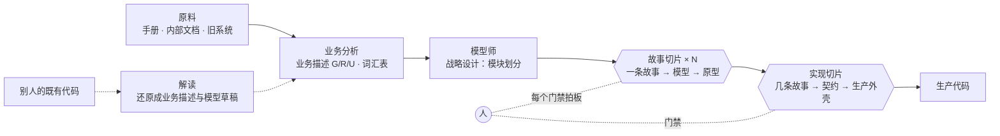
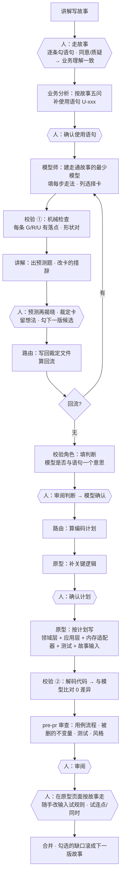
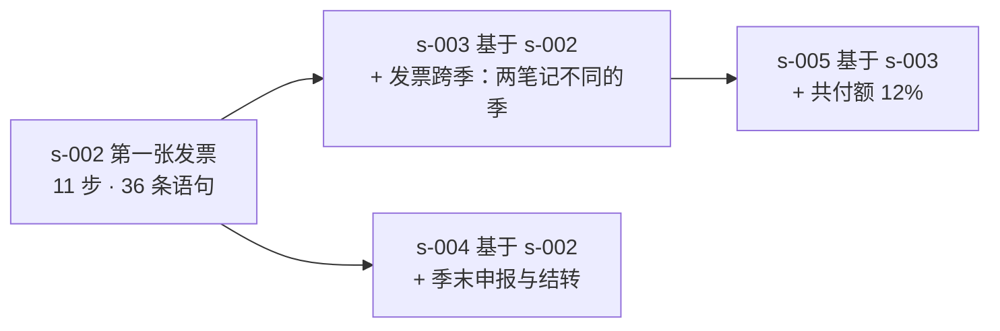

# dev-team 工作流程图

一页看懂 dev-team 怎么把「业务」变成「能按的原型」再变成「生产代码」，谁在哪一步上场，人在哪里拍板。例子全部来自陈太太的第一张发票（`example/` 之外的真实验收项目）。

## 一、全景：三条线

- **业务描述**是唯一源头：目标 `G-xxx`（谁能做到什么）、规则 `R-xxx`（一次操作对不对）、使用 `U-xxx`（系统会被怎么用）。
- **故事切片**是默认的工作单位：一条能从头走到尾的故事。第一条是最贴近日常的主线，之后每条基于上一条只多一段（滚雪球）。
- **实现切片**把几条已在原型上走通的故事一起变成生产代码，领域代码不重写，只补外壳。

## 二、一条故事切片：谁上场、人在哪拍板

六边形是人拍板的门禁。`slice next` 随时算出当前卡在哪一步、该谁上场、跑什么命令；路由一次只推进一步，推进完停下来向人报告。

### 小例子：每一步长什么样

| 步 | 例子 |
|---|---|
| 讲解写故事 | 第 7 步「物理治疗诊所送来一张发票：物理治疗每周一次共四次，每次 $120……消耗额度的金额 = 120 × 4 = $480。此刻还没批准，两套余额都不动。」下面挂着它依据的 11 条语句。 |
| 人走故事 | 第 6 步人质疑：「照护管理拨款按季度算还是一整年一起算？」路由答：按季，每季扣 10%；取整规则没写，加一张裁定卡。人改成同意。 |
| 使用语句 | U-006「一张发票上的几行服务一次登记；其中一行不能登记，整张发票都不登记，也不留下任何一笔支出」（依据：c10 甲）。答不了的列成选择给人：「同一张发票登记两次怎么算？甲 第二次不成立 / 乙 允许，靠复核发现」。 |
| 模型师走故事 | 第 9 步走法：`命令 ApproveExpense → Expenses.Expense`，写入的事实：1. 支出状态变为已批准 2. 余额不足时标超支；发出 `ExpenseApproved`；可能拒绝 `ExpenseNotAllowed`。 |
| 选择卡 | c1「一张发票四次服务分布在四天，服务发生日记哪一天？」甲 记最后一次 / 乙 记第一次 / 丙 拆成四笔各记各的。每个选项带后果与金额例子。人选丙，与模型现状不同 → 回流模型师。 |
| 预测题 | 「第 6 步之后服务预算是多少？」人填 8895.38，揭晓：模型算 9,883.76 − 988.38 = 8,895.38，答对。 |
| 校验 ① | 机械：R-076 有落点（事件处理 `ReduceProviderBalanceOnExpenseApproved`）；`RecordSupplierInvoice` 一个命令写两个聚合 → 「需人确认」一条，人在卡 c13 上拍板。 |
| 编码计划 | 30 步：先建被引用的聚合（Participant、FundingAllocation）→ 仓储接口 → 用例 → 端口 → 内存适配器与装配 → 测试 → 故事输入。原型在「批准支出」那步补关键逻辑：「服务发生日在未来时在 approve 守卫处抛 ExpenseNotAllowed（c2 乙）」。 |
| 原型 | 页面上选故事、点「从头走到底」：9 步全过，第 6 步查出服务预算 8,895.38。改输入试：把单价改成 9,000 再批，看到「超支」标记；10 月 7 日批 10 月 8 日那笔，被 `ExpenseNotAllowed` 拒绝。 |
| 校验 ② | 从代码解码出模型与设计模型比：0 差异。有差异时每条标「模型有、代码无」或「不一致」，文字差异交校验角色判是不是一个意思。 |
| pre-pr 审查 | 角度 B「被删的不变量」：代码里 `MyAgedCareId` 不得为空没有守卫 → 发现一条，带文件:行与失败场景，人审阅后回流原型。 |

## 三、实现切片：从原型到生产

例子：`slice new <项目> s-010 陈太太上线 --implements s-002,s-003`。范围从两条故事走过的聚合与用例自动推出（Participant、FundingAllocation、FundingAccount、Invoice、Expense；9 个命令 2 个查询）。契约里 `http.ApproveExpense` 的字段名必须等于模型命令的 `input`（`expenseId`、`serviceInScopeReviewed`），`contract check` 会查；没问过人的地方标「（没问过）」，人推迟的标「（故意推迟）」，编码不得实现推迟项。

## 四、故事滚雪球

每一版：`slice new … --story --based-on s-002`，老步骤原样带过来（页面标「上一版已有」），只加新段，整条重新走通；模型只加新段需要的最少部分，但每一步都重走，保证老路没断。上一版故事页上勾选的缺口就是下一版的「这版加了什么」；没勾的候选自动跟到下一版。框架图上按谱系列故事，绿色 `+n` 是这版比上一版新点亮的目标、规则、聚合。

## 五、既有代码怎么进来

例子：`read <代码库> <项目>`。盘点列出 7 个疑似入口（控制器、处理器）、7 个疑似持久化（实体、仓储）；解读把「订单确认后不能再加行」从校验代码里提出来写成 `R-001 (不变量)`，出处 `src/order/order.service.ts:88`，把握程度标「确定」；两个目录互相引用的地方标「存疑：边界划不清」交人。

## 六、九个角色一句话

| 角色 | 一句话 | 只写 |
|---|---|---|
| 业务分析 | 原料 → 目标、规则、使用语句、词汇表；冲突列裁定清单 | `business/`、`glossary.json` |
| 讲解 | 给人写故事、导读、预测题、缺口；节奏按人一次能消化多少 | 故事文件、`导读/` |
| 模型师 | 建走通故事的最少模型；每步填走法；有选择就列卡，不许默默定 | `model/`、故事的 walk 与 choices |
| 原型 | 按计划写领域层与应用层（就是最终代码）+ 内存适配器 + 测试，装进原型 | 代码库、故事的 walk.input、计划的 keyLogic |
| 接口 | 实现切片的契约：HTTP、表结构、错误码 | `contracts/` |
| 编码 | 生产外壳：数据库、消息、接口 | 代码库 |
| 模型校验 | 校验 ① ② 的判断：模型与语句、代码与模型是不是一个意思 | `reports/` |
| pre-pr 审查 | 代码合并前的七个角度 | `reports/pre-pr-*.json` |
| 解读 | 既有代码 → 业务描述与模型草稿 | `business/`、`model/` 草稿 |

路由（`SKILL.md`）不是角色：它按切片状态决定下一步该谁上场、把角色的产出和问题清单原样转给人、把人拍板的事记进裁定文件。人可以直接改任何工件，改完 `slice next` 重算。

## 七、人看的三个页面

| 页面 | 干什么 |
|---|---|
| 框架图 `story serve` → `/` | 模块关系图；点故事看它点亮了哪些域、多少目标 / 规则 / 聚合；谱系与 `+n` |
| 走故事 `/story?slice=<id>` | 逐条勾语句、同意 / 质疑、预测再揭晓、裁定卡挂在步骤下、缺口勾成下一版 |
| 模型图 `/model` | 关系图 + 卡片 + 业务覆盖；卡片下留意见，`slice next` 会先要求路由回应 |
| 原型 `proto serve` | 按故事走、手动跑命令、看聚合状态与事件流水、重置、重新编译 |
